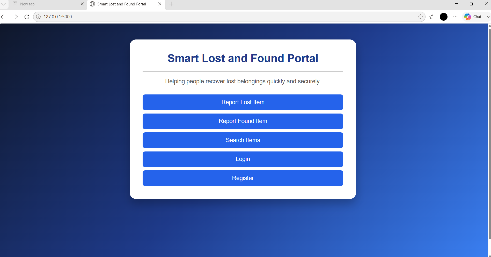
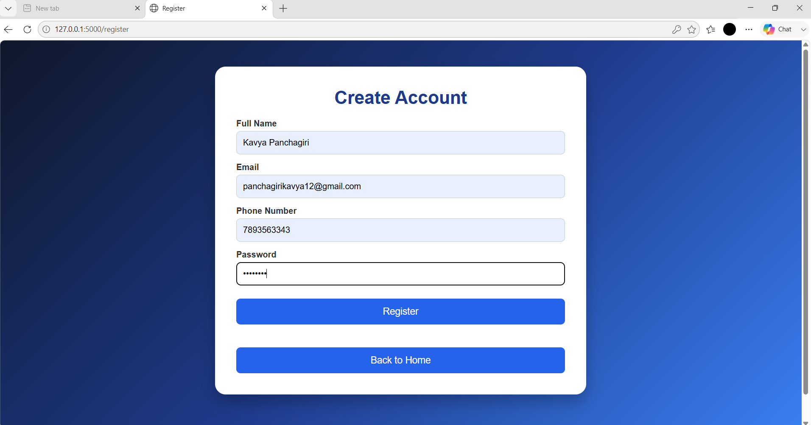
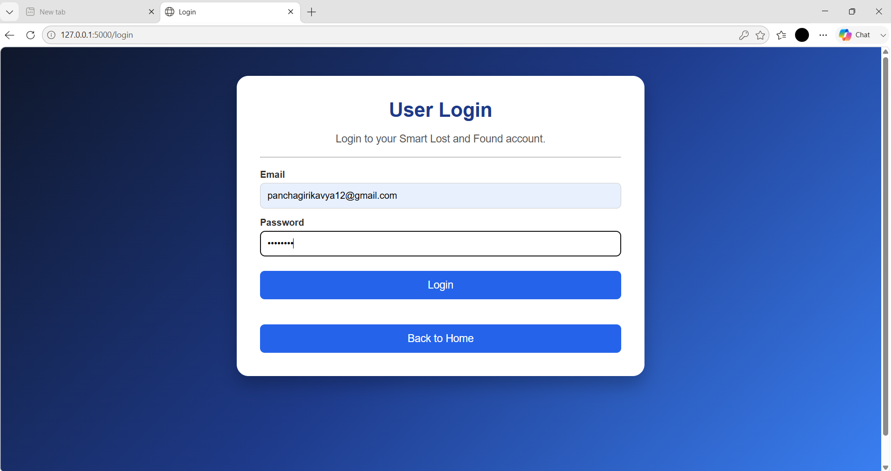
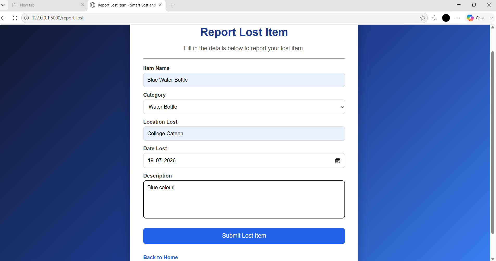
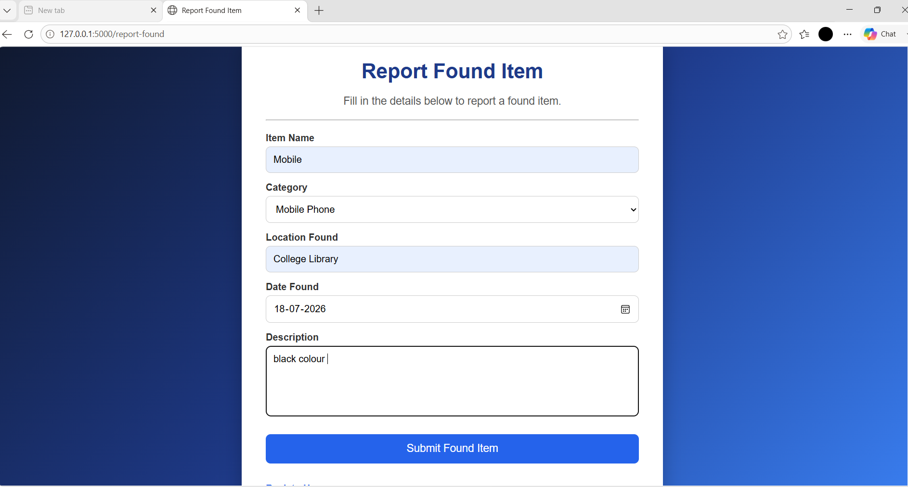
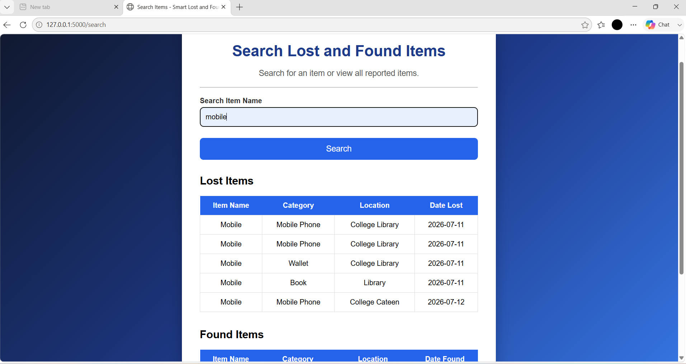
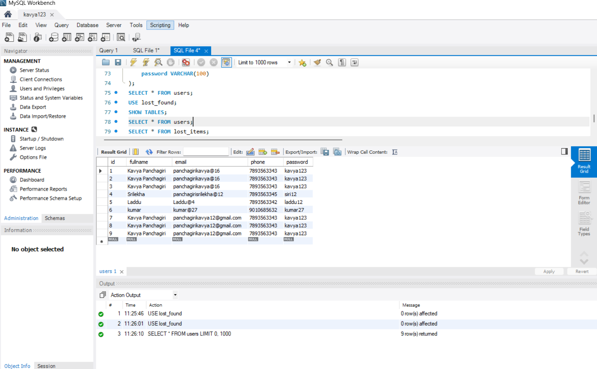
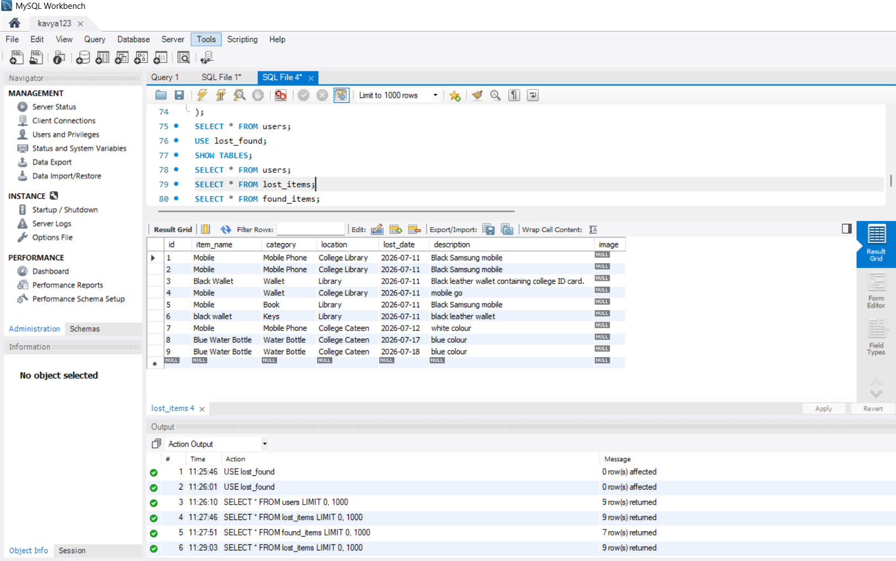
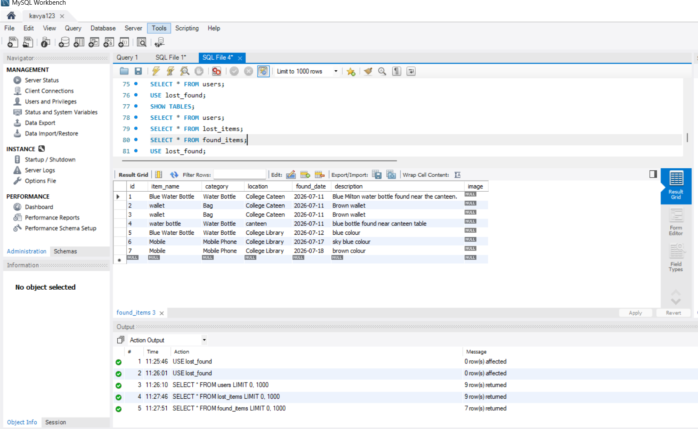

# Smart Lost and Found Portal

## Project Overview

Smart Lost and Found Portal is a web application developed using Python, Flask, HTML, CSS, and MySQL.

The purpose of this project is to provide a simple platform where users can register, log in, report lost items, report found items, search for available items, and store the information in a MySQL database.

This project was developed as part of my B.Tech learning journey to improve my backend web development skills and gain practical experience in building web applications using Flask and MySQL.

---

## Why This Project?

People often lose personal belongings in colleges, offices, hostels, and public places. Without a proper system, it becomes difficult to report and search for lost or found items.

This project provides a simple solution where users can register, log in, report lost items, report found items, and search for available items through a web interface. All information is stored in a MySQL database, making it easy to manage and retrieve records.

---

## Features

- User Registration
- User Login
- Report Lost Items
- Report Found Items
- Search Lost and Found Items
- Store user and item information in MySQL
- Simple and user-friendly interface

---

## Technologies Used

- Python
- Flask
- HTML
- CSS
- MySQL
- Visual Studio Code

---

## Project Structure

```text
SmartLostFoundPortal/
│
├── static/
│   └── style.css
│
├── templates/
│   ├── index.html
│   ├── login.html
│   ├── register.html
│   ├── report_lost.html
│   ├── report_found.html
│   ├── search.html
│   ├── success.html
│   ├── admin.html
│   ├── login_success.html
│   └── login_failed.html
│
├── screenshots/
│   ├── home.png
│   ├── login.png
│   ├── register.png
│   ├── report_lost.png
│   ├── report_found.png
│   ├── search.png
│   ├── users_table.png
│   ├── lost_table.png
│   └── found_table.png
│
├── app.py
├── db.py
└── README.md
```

---

## Database

This project uses MySQL as the backend database.

### Database Name

```text
lost_found
```

### Tables Used

- users
- lost_items
- found_items

The database stores:

- User registration details
- Lost item details
- Found item details

---

## How the Project Works

1. Users create a new account.
2. Users log in using their registered credentials.
3. Users can report lost items.
4. Users can report found items.
5. The submitted information is stored in the MySQL database.
6. Users can search for available lost and found items through the portal.

---

## Project Screenshots

### Home Page



The home page provides navigation to the main features of the Smart Lost and Found Portal.

---

### User Registration



New users can create an account by entering their details.

---

### User Login



Registered users can securely log in to access the portal.

---

### Report Lost Item



Users can submit details of lost items.

---

### Report Found Item



Users can submit details of found items.

---

### Search Items



Users can search available lost and found items stored in the database.

---

### Users Table (MySQL)



Stores all registered user information.

---

### Lost Items Table (MySQL)



Stores details of all reported lost items.

---

### Found Items Table (MySQL)



Stores details of all reported found items.

---

## How to Run the Project

1. Install Python.
2. Install MySQL Server.
3. Create the `lost_found` database.
4. Create the required database tables.
5. Install the required Python packages.
6. Open the `db.py` file.
7. Replace the placeholder with your own MySQL username and password.

```python
username = "YOUR_USERNAME"
password = "YOUR_MYSQL_PASSWORD"
```

8. Run the application.

```bash
python app.py
```

9. Open your web browser and visit:

```text
http://127.0.0.1:5000
```

---

## Important Note

For security reasons, the actual MySQL username and password are not included in this repository.

Before running the project, update the MySQL credentials in `db.py` according to your local MySQL installation.

---

## Learning Outcomes

Through this project, I learned:

- Building web applications using Flask
- Python backend development
- HTML and CSS page design
- Connecting Flask with MySQL
- Database connectivity and CRUD operations
- User authentication basics
- Organizing a Flask project using templates and static files
- Uploading and documenting projects on GitHub

---

## Author

**Kavya Panchagiri**

This project was developed independently as part of my B.Tech learning journey with guidance from ChatGPT. I implemented, tested, debugged, documented, and uploaded the project to GitHub to strengthen my practical skills in Python, Flask, HTML, CSS, and MySQ.
